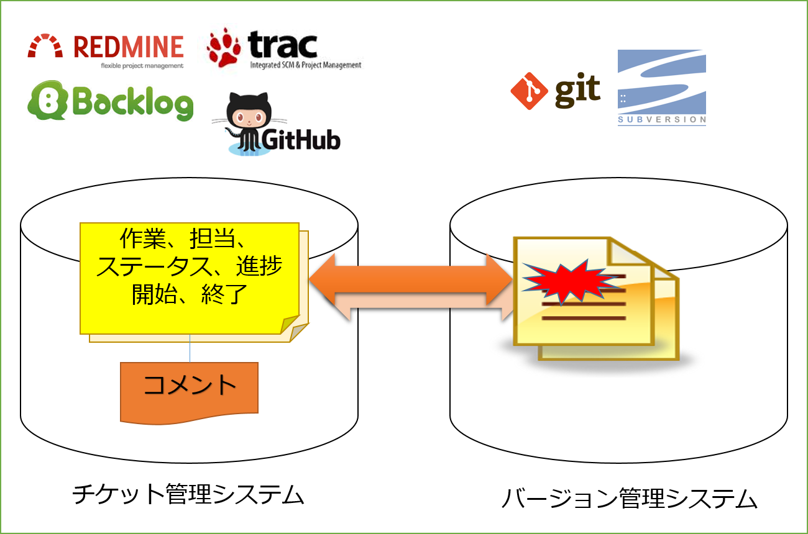

<!-- $theme: gaia -->

# チケット管理システムとバージョン管理システムの連携
----

チケットとソースコードの変更を関連づけることによって、課題やバグの追跡が行いやすくなり  
プロジェクト管理がよりスムーズになる

GitHub/Trac/Backlog/Redmineは蜜に統合されたシステムであり相互連携は取りやすい。  
JIRAやPivotalTrackerは前者より独立運用性が高い反面、相互連携がしにくい面もある。

----
# 連携によってできること

## コミットからチケットのリンク
開発者視点でコードの変更を追跡する際に便利。  
チケット管理システムとバージョン管理システムが蜜に統合されたシステムで利用可能。  
※JIRAやPivotalTrackerでは難しいので注意。

## チケットからコミットへのリンク
QA担当者や顧客に近いステークホルダーの視点で、課題の顛末確認や、影響範囲を追跡する際に便利。  
設定を適切に行っておけばどのシステムでも利用可能。 -> 積極的に利用すべし

## コミットと同時にチケットのステータスを変更する
開発者のコミット作業とプロジェクトのワークフローを関連づけて、スピーディな開発を支援する便利機能。

# 連携の設定方法(Issue機能)
GitHubのIssue機能とソースコードの変更の関連付けは最も簡単。  
コミットメッセージに以下のようにIssue番号を入れるだけ。
> fixed #21  

これでこのコミットと21番のissue間で相互リンクが貼られ、issueのステータスをcloseに変更できる。  
fixed以外にも以下のキーワードで同等のことが可能。  
close
closes
closed
fix
fixes
fixed
resolve
resolves
resolved  

異なるリポジトリのIssueを閉じる場合は、「username/repository#issue_number」で指定可能。  
  
複数の Issue を閉じるにはコミットメッセージに複数のキーワードと番号を書けば良い。例えば
>This fixes #34, resolves #23, and closes example_user/example_repo#42  

と書けば、#34, #23 および example_user/example_repo リポジトリ #42 の Issue を閉じてくれる。

**「コードベースの簡単な管理であればGitHubのIssue機能で十分」**  
→豊富なレポート機能を使ったり、細かい進捗管理をしたい場合は、別途チケット管理システムを用意し、GitHubはバージョン管理システムとして使うべし。　　

【参考】Issue管理→Trello管理→GitHub Projects管理に移行した人の記事  
 [TrelloからGitHub Projectsに移行した](http://qiita.com/konnobu/items/be4cab857e2ed91ca9a8)

----
# 連携の設定方法(Service Hooks)
Service Hooks　→　GitHubはリポジトリごとに他のサービスと連携できる機構  
PushだったりPull-Requestなりのイベントを他サービスに通知して、連携することが可能。  
署名なWebサービスにはほとんど対応している。具体的に各サービスでどのイベントに対応しているかは以下参照。
[GitHubのHook仕様](https://api.github.com/hooks)  
  
社内システムなどと連携したい場合、当然のごとくServicehooksは用意されていない。 
以下の方法で連携することが可能。   
1 Webhooksを使う  
2 独自にServicehookを開発する
