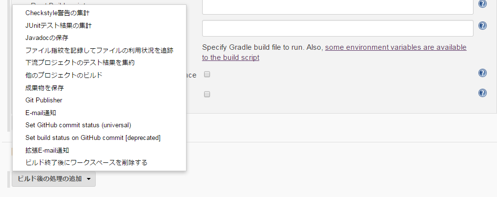

<!-- $theme: gaia -->

# Jenkinsを使ったCIの実行

## セットアップ

* 公式サイトからWARファイルをダウンロード以下のように実行

```
java -jar jenkins.war –-httpPort=8080

ソケット周りでエラーが出た場合は

java -Djava.net.preferIPv4Stack=true -jar jenkins.war --httpPort=8080
```

* ネイティブパッケージを使う

	OSのサービスとして起動する(公式サイトに参考)

	例：　Linux(Red Hat)

```
###install###
$ wget -0 /etc/yum.repos.d/jenkins.repo http://pkg.jenkins-ci.org/redhat/jenkins.repo

$ rpm --import http://pkg.jenkins-ci.org/redhat/jenkins-ci.org.key

$ yum install jenkins
```


```
###start###
$ etc/rc.d/init.d/jenkins start
```

* Deploy to Azure

----
## 基本機能

* ソースコードをチェックアウト
* 自動でビルドおよびテストの実行
* 結果を集計しレポーティング
* 通知

### ジョブの新規作成

ジョブという単位で一連のプロセスを管理する

　→フリースタイル・プロジェクトを選択

### ソースコードをチェックアウト

* バージョン管理システムとの連携
* Gitの場合はプラグインを追加する必要=>[プラグイン紹介](https://www.slideshare.net/linoSth/javajenkins-25tips?qid=71373c58-137d-4e37-9773-c92ac64fedbc&v=&b=&from_search=2)
* Jenkinsの管理→プラグインの管理→Git Pluginをインストール

### 自動でビルドおよびテストの実行

**ビルド・トリガ**

* 定期実行： 一日一回ビルドとか、厳密CIではない。
* バージョン管理システムをポーリング： コミット(push)を監視して変更がある時ビルドを実行
	* バージョン管理システムに無駄な負荷をかけないように
	* ビルドの実行頻度高くなるため、ビルドのスビードが重要

* バージョン管理システムからプッシュ：　バージョン管理システムからリクエスト来る
	* Gitのイベント(コミット、Pushなど)を発生する時関連つけて特定のスクリプトを実行できるフックを設定
	* PushされたタイミングでJenkinsのジョブを実行する場合


```
.git/hooks/post-receiveファイル作成、以下の内容を記入(Git Pluginインストール前提で)

#!/bin/sh
curl http://{jenkinsサーバのドメイン名またはIPアドレス}/jenkins/git/notifyCommit?url={GitリポジトリのURL}&branches={ブランチ名(複数可)}
```

* GithubのService Hooksで設定すれば同じことをできるが、GitHubから見える場所にJenkinsを置く必要がある。また、リクエストのIPアドレスを公開するので、Jenkinsに対してIP制限をかければ、セキュリティ的な懸念は解消できる。

**ビルドの記述**

* ビルドおよびテストの処理を記述
* 記述方法
	* GradleやMaven
	* Windowsのバッチコマンド
	* シェルスクリプト

### 結果を集計

* JUnitXML形式で出力するのは効率的



### カバレッジを計測する

* 計測ツール：
	* Cobertura
	* Jacoco
	* Scct
	* SimpleCov
	* Rcov

* Jacoco

 プロジェクトでカバレッジ取得後、Jacocoの計測実行ファイルをJenkins側でレポートを出す
	
	* GradleでJavaプロジェクトを作成として、build.gradleに以下のコードを追加
	* Jacoco PluginをJenkins側で追加
	* ビルドタスク中でjacocoを追加

```
apply plugin: 'jacoco'

jacoco {
    toolVersion = "0.7.7.201606060606"
}
...
dependencies {
    ...
    compile group: 'org.jacoco', name: 'org.jacoco.core', version: '0.7.7.201606060606'
    ...
}
```

### 静的解析をする

* 静的解析ツール
	* Checkstyle
	* PMD
	* Findbugs
* コードレビューの負担を減る
* 動的型付け言語向けのツールが少ない
	* Javascript: JSLint
	* Python: mypy, pylint

### 通知

* メール
* Twitter
* IRC
* XFD

## 参考資料

[はじめてのJenkins](http://qiita.com/nyasba/items/eea459e97a56c5d43fce#job%E3%81%AE%E6%89%8B%E5%8B%95%E5%AE%9F%E8%A1%8C)

[ぼくとJenkinsおじさんの360日戦争](https://www.slideshare.net/goccy/tech-hills-jenkinsgoshima)

[Jenkins＋Vagrantでテストを分散しよう](http://www.buildinsider.net/enterprise/jenkins/004)