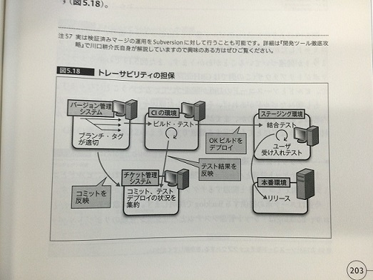
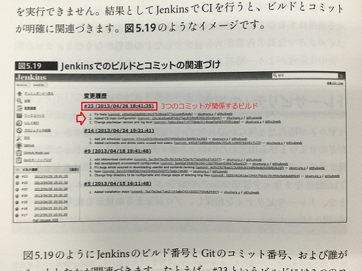

<!-- $theme: gaia -->

# 
チーム開発実践入門

### 
5.5-5.6 CIの運用

#### 
手島　史裕

---

# 目次

* ビルドが壊れたらどうするか
* トレーサビリティの担保
* CIによって得られるもの

---
###### ビルドが壊れたらどうするか

* すべてのメンバーのコミットを禁止する

* 中央集権型バージョン管理の場合、別の人のコミットが重なり修正が困難になる
* 分散バージョン管理でも原則は同じだが、github-flowのように、メンバーが各々のリポジトリを持ち、Pull Requestを送る運用であれば、必ずしもコミットを禁止する必要はない。

* テストしてからマージする

* そもそもビルドが壊れた状態でcommitされない環境を作る
* JenkinsとGithubの連携の場合、PullRequestを送ると、自動的にビルドが実行され、結果が視覚的に確認できるようになる。
* Githubを使わなくても、検証済みの間違いないものだけをメインラインにマージする運用により、チーム開発の生産性が向上する。 

---
###### トレーサビリティの担保

* Jenkinsをチケット管理システムやバージョン管理システムと連携することで、プロジェクトを可視化する

---

* ビルドとコミットの関連付け

 

* CI環境を構築すれば必然的にビルドとコミットが関連づく
* どのビルドとどのコミットが関連づくかわかるため、トラブルの対応が容易になる

---

* チケット管理との連携

 

* チケット管理とバージョン管理を連携させることで、変更履歴からチケット番号のリンクをたどることができる。
* Jenkinsの場合、Backlog、Trac、Redmineといった様々なチケットツールと連携が可能

---

###### CIによって得られるもの
* CIサーバーで情報を一元管理することで、トレーサビリティを担保し、プロジェクトを可視化できる。
* 常に動作可能なアプリケーションを維持できる。
* CIの次は**即座に本番環境にリリース可能**な状態を維持するCD(継続的デリバリー)である。

