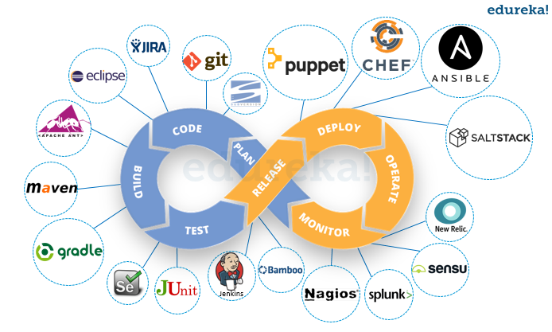

<!-- $theme: gaia -->

# デプロイの自動化
### DevOpsのすすめ

----
# デプロイ自動化は何のため？

----
# すべてはDevOpsのため！
# 

----
#### DevOpsとは
* Development + Operation(開発と運用)を組み合わせた造語
	* DevとOpsは目的が同じでも対立しがち
* ["10 deploys per day"](https://www.slideshare.net/jallspaw/10-deploys-per-day-dev-and-ops-cooperation-at-flickr)  Velocity 2009 で話題に
* 開発と運用が連携することで、
	* 市場投入までの時間短縮
	* 改良された信頼性の高いリリース
	* 迅速なフィードバックによる製品改良
* DevOps(もっと言うとリーン)は日本発！(トヨタ生産方式)

----
## DevOpsの本質はツールではない！
# 
## DevOpsは文化！
----
## DevOpsで重要な3ways
* [Gene Kim の3ways](https://blogs.technet.microsoft.com/livedevopsinjapan/2015/11/13/devops-enterprise-2015-2-dockerdevops/)
	* 1way: リードタイムの短縮
	* 2way: 本番環境やユーザーからの学び
	* 3way: 継続的な実験と検証

### Zeta KCに必要不可欠なプラクティス
----
# 1way: リードタイムの短縮
* アジャイルなソフトウェア開発
	* スクラム(JIRA, Trello etc...)
	* github-flowによる非同期レビュー(Github, BitBucket)
	* 自動テスト(Jenkins, TravisCI, CircleCI, Drone.io etc...)
	* デプロイ自動化(vagrant, docker, ansible etc...)
	*  柔軟な運用環境(AWS, Azure, nginx, docker etc...)

----
# 2way: 本番環境やユーザーからの学び
* [あんどん方式](http://d.hatena.ne.jp/humitake+hiseikikeizai/20121015/1350311193)(参考：トヨタの生産方式)
	* 異常に気づいた人がすぐにラインを停められる
	* そして、修正を加えて再稼働できる
* Immutable Delivery(環境もバイナリにまとめてデプロイする)
	* 迅速で確実なロールバック(再ビルドしない)
	* Immutableであるがゆえに作成時の情報を一元的に参照できる
	

----
# 3way: 継続的な実験と検証
* 1wayと2wayを継続的に回していく仕組み
	* 運用でのフィードバックを即座に取り入れる
	* OSSであればGithubでホストしてIssueに対応する
	* 新機能開発と運用からのフィードバックの優先順位付け
----
# DevOpsな文化とは
* 3waysで語られていることは当たり前だよねという認識
* そのためのツールをしっかり使えるようにしようね。たくさんリリースしましょうね。
	* デプロイに手動で30分かかっているところをツールで3分に短縮すれば、27分/deployの削減
	* 半年一回のdeployじゃ意味ないけど、一日一回deployとすると一週間で約二時間半
	* 一ヶ月で約10時間。これがデプロイ数が増えるごとに増えていく
----
# 自動デプロイツールの話

----
# デプロイあるある
* 新しい機能追加したら本番環境で動かない！
* 新しい開発者追加したら、その開発者環境でビルドがコケる！
* デプロイ作業の手順が技メモにあってうまくいかない！(メンテされてない！)
* スクリプト化されているけど途中でコケたら手でなんとかする！

----
# 重要なこと
# 放置しない

----
### 放置しないことを承知した上で
#### Webサーバーアプリケーションを例に
* vagrant + Dockerで環境を整備する

----
# Vagrant  
* ある環境に仮想環境を構築するためのスクリプトを実行できるRuby製のツール
* 主にVirtualBoxのセットアップの自動化をするが、それ以外の仮想環境も設定可能
* vagrantfileを記述して
* `vagrant up`で完了！
----
# Docker 
* Linuxカーネルにおける「libcontainer」と呼ばれるコンテナ技術を利用したGo製コンテナツール
* コンテナのイメージをDockerHubというサービスでホスト
* Dockerfileでコンテナの管理、立ち上げを全てスクリプト化
----
# コンテナ
# 

----
# Dockerのライフサイクル
# 

----
#### Vagrant + Dockerでの仮想環境立ち上げ
* 時間ないのでブログ引用（笑）
* [Vagrant1.6のDocker provider by SOTA](http://deeeet.com/writing/2014/05/08/vagrant-docker-provider/)

----
# まとめ
* 早く回すために必要なのは気合じゃないよ。言うだけじゃだめだよ。
* 必要なのは文化とスキル(プロセス作り)
* Zeta＆KCで文化を少しずつ作る
* スキルをしっかりつけていく（ツールを実践に組み入れていく）
* DevOpsのためのツール群の案作成中ですので、しばらくお待ち下さい