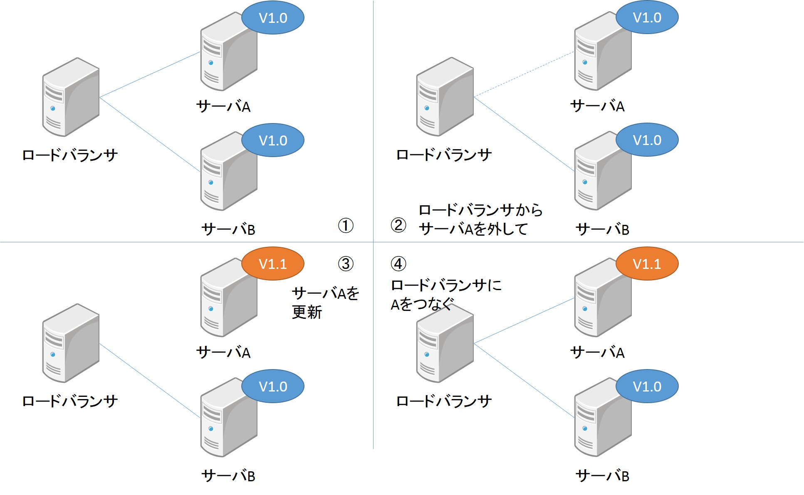
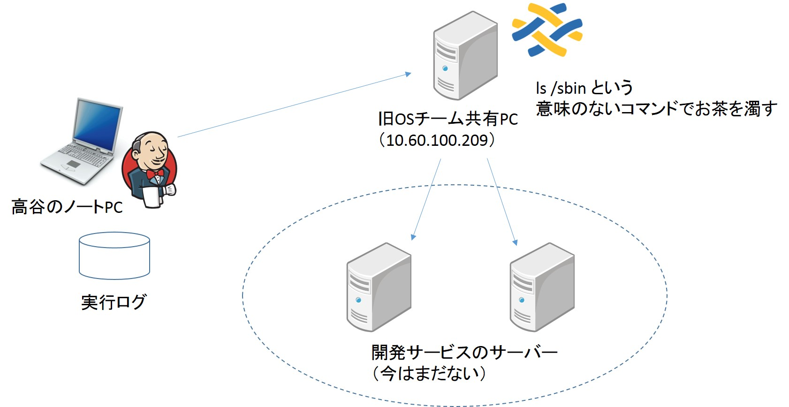

<!-- $theme: gaia -->

# 6.5 オーケストレーション（デプロイの自動化）
### 2017/06/30
### takaya

---
<!-- page_number: true -->

# 前回までのおさらい
デプロイに関わる作業はすべて自動化されるべき 

* ブートストラッピング　OS、仮想マシンの立ち上げの自動化（6.2）
* コンフィグレーション　サーバやミドルウェアの設定を自動化（6.3）
* オーケストレーション　リリース作業の自動化　（今回はここ）

---
# リリース作業

# 

---
# リリース作業のアンチパターン
（耳が痛い）
*　リリース作業を手動で行う
*　リリース作業の内容が毎回違う
*　リリース作業に特別な知識が必要
*　何度も繰り返してリリースが行えない

---
# 自動デプロイツール
書籍で紹介されているのは3種類
* Capistrano
* Fabric
* Jenkins

---
# Fabric
* 要するに、Pythonでラップしたシェルスクリプト
* シェルスクリプトで出来ることは何でも出来る
* Pythonの機能も使えるので、シェルスクリプトよりも可読性が高くなりやすい
* （個人的に）覚えることが少ないので、導入の敷居が低い

---
# Fabric の利用方法
* fabfile 動作を定義

* fab コマンドで実行
基本

`fab -H ホスト名 (-f fabfile) shell_command`

次のページで実演。

* 細かいオプションはこちら　[fab オプションと引数](http://fabric-ja.readthedocs.io/ja/latest/usage/fab.html)

---
# Jenkins
前にも出て来ているので省略。
この章の場合は、ボタン一つで設定したシェルスクリプトを動かす使い方

---
# Jenkins+fabricの実演
P.252の簡易版を実際にやってみます。
# 

---
# 言うても手作業が必要な場合
* 初回環境構築
* 障害対策
* 緊急のサービス再起動
* 自動デプロイの仕組みがトラぶった場合の復旧

---
# まとめ
* リリース職人がいないと回らないのはダメ絶対
（が、今まで通ってきたテーマは大体リリース職人がいた気がする）

---
# 参考にしたスライド

* [デプロイツールFabric](https://www.slideshare.net/kamekoopa/fabric-20004053)

* [2日間Fabricを触った俺が
 色々解説してみる](https://www.slideshare.net/ryojiishii14/fabric-46215238)

